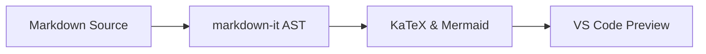

# VMark Architecture & Core Capabilities

VMark is a high-performance, VS Code-style Markdown workbench running natively inside Google Chrome.

## 1. Extension Engine & Pipeline

The preview pipeline matches VS Code's official language feature stack for 100% rendering fidelity:

```typescript
import { MarkdownPreviewEngine } from 'vmark';

const engine = new MarkdownPreviewEngine({ theme: 'vscode-dark' });
const { html, hasMermaid } = engine.render(source);
console.log('✓ Render pipeline ready');
```

## 2. LaTeX Mathematical Expressions

Full KaTeX mathematical notation with inline $e^{i\pi} + 1 = 0$ formulas and display blocks:

$$
\mathcal{F}(\omega) = \frac{1}{\sqrt{2\pi}} \int_{-\infty}^{\infty} f(t) e^{-i\omega t} \, dt
$$

## 3. Theme-Adaptive Mermaid Diagrams

Real-time interactive flowcharts, sequence diagrams, and architecture maps:


