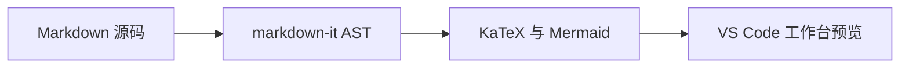

# VMark 架构设计与核心功能

VMark 是专为 Google Chrome 打造的 VS Code 级 Markdown 工作台扩展。

## 1. 核心扩展引擎与渲染管线

深度对齐 VS Code 官方语言特性渲染栈，支持高保真样式与语法高亮：

```typescript
import { MarkdownPreviewEngine } from 'vmark';

const engine = new MarkdownPreviewEngine({ theme: 'vscode-dark' });
const { html, hasMermaid } = engine.render(source);
console.log('✓ 渲染引擎就绪');
```

## 2. LaTeX 数学公式排版

完整支持行内 $e^{i\pi} + 1 = 0$ 公式与多行 KaTeX 复杂数学表达式：

$$
\mathcal{F}(\omega) = \frac{1}{\sqrt{2\pi}} \int_{-\infty}^{\infty} f(t) e^{-i\omega t} \, dt
$$

## 3. 主题自适应 Mermaid 架构图

实时渲染交互式架构图、流程图与时序图，色彩方案随主题自适应：


